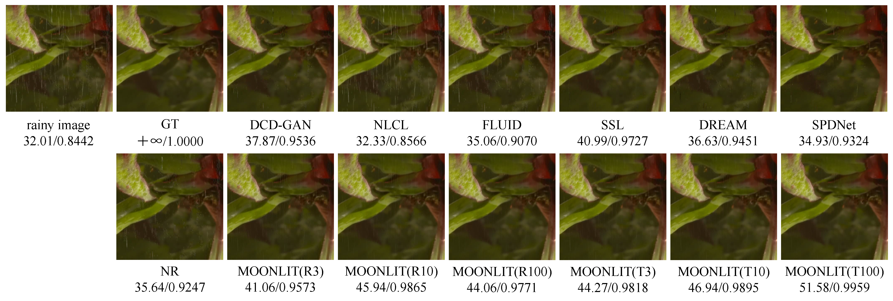

# MOONLIT: Momentum-contrast and Large-kernel for Multi-fine-grained Deraining
code for MOONLIT: Momentum-contrast and Large-kernel for Multi-fine-grained Deraining

train:
`python train.py --batch_size 100 --net_name 'resnet'`

`batch_size` can be set to 3, 10 or 100, meaning that the raind streaks are fine-grained into 3, 10 and 100 classes.

`net_name` can be set to `'resnet'` or `'vit'`, meaning that the encoder of UMRC uses Resnet200-2x or ViT-L.

## Abstract
Deep learning-based methods have achieved excellent performance in image deraining task. Unfortunately, most existing deraining methods assume a uniform rain streak distribution and a fixed grain size of fine-grained, and this rain streak uncertainty will lead to model errors. In addition, some existing convolution-based methods infer an extended receptive field mainly by stacking convolution kernels, which often leads to some feature extraction errors or mistakes. In this work, we propose momentum-contrast and large-kernel for multi-fine-grained deraining (MOONLIT) network. Treating different fine-grained rainy images as different degradation tasks, we use the unsupervised dictionary contrastive learning method not only to exploit the information of different fine-grained rain streaks, but also to consider the distance between the encoded samples of the dictionary, the anchor, and the positive and negative samples. We then have carefully constructed a restoration network based on large-kernel convolution, which takes the features extracted by unsupervised contrastive learning and processes them through a larger and more accurate receptive field. In addition to the large-kernel convolution strategy, an informative adjustment of sampling locations is considered in the restoration network to better remove rain streaks. The strategies of considering multi-fine-grained and introducing large-kernel convolution address the error problem caused by rain streak uncertainty and the feature extraction error caused by small convolution kernels, respectively. Extensive experiments on synthetic and real-world deraining datasets show that the proposed method MOONLIT achieves the state-of-the-art performance on some datasets.

Comparison of selected results of MOONLIT with 7 SOTA methods on the SPA-DATA dataset
